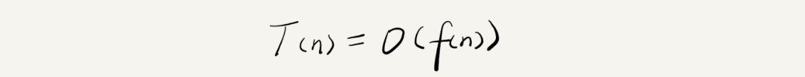
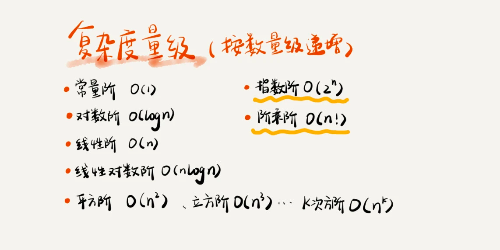

Algorithms
---

## 数据结构与算法之美

> 要学习它的“来历”、“自身的特点”、“适合解决的问题”，以及“实际的应用场景”。
> 千万不要被动地记忆，要多辩证地思考，多问为什么。
> 边学边练：每周花 1～2 个小时的时间，集中把这周的三节内容涉及的数据结构和算法，全都自己写出来，用代码实现一遍。
> 多问、多思考、多互动，避免一知半解：找到几个人一起学习，一块儿讨论切磋，有问题及时寻求答疑。
> 学习知识的过程是反复迭代、不断沉淀的过程。

### 最重要的概念

1. 复杂度分析

   时间、空间复杂度分析：执行效率是算法一个非常重要的考量指标，即如何让代码运行得更快，如何让代码更省存储空间。
   不用具体的测试数据来测试，就可以粗略地估计算法的执行效率的方法。
   
   
   T(n) 代码执行的时间；n 表示数据规模的大小；f(n) 表示每行代码执行的次数总和。公式中的 O，表示代码的执行时间 T(n) 与 f(n) 表达式成正比。
   
   **大 O 时间复杂度**实际上并不具体表示代码真正的执行时间，而是表示**代码执行时间随数据规模增长的变化趋势**(一个算法执行效率与数据规模增长的变化趋势)，所以，也叫作**渐进时间复杂度**（asymptotic time complexity），简称**时间复杂度**。
   公式中的低阶、常量、系数三部分并不左右增长趋势，所以都可以忽略，只需要记录一个最大量级就可以了。
   
   - 只关注循环执行次数最多的一段代码
   - 加法法则：总复杂度等于量级最大的那段代码的复杂度
   - 乘法法则(嵌套循环)：嵌套代码的复杂度，等于嵌套内外代码复杂度的乘积
   
   

   可以粗略地分为两类，多项式量级和非多项式量级。其中，非多项式量级只有两个：O(2n) 和 O(n!)。

2. 数据结构

   10 个数据结构：数组、链表、栈、队列、散列表、二叉树、堆、跳表、图、Trie 树；

3. 算法

   递归、排序、二分查找、搜索、哈希算法、贪心算法、分治算法、回溯算法、动态规划、字符串匹配算法；

